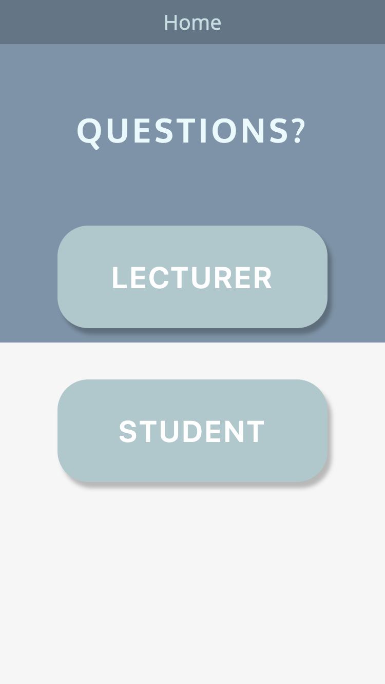
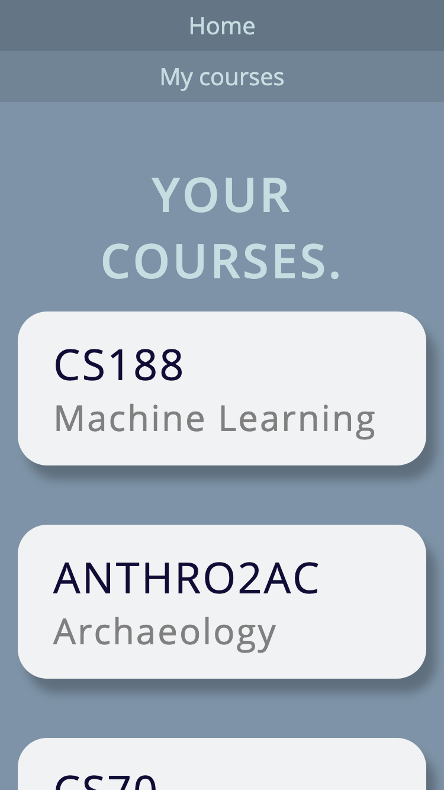
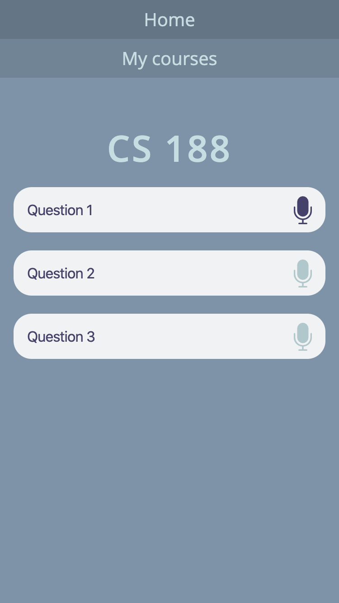

# Stanford Treehacks - Team: Questions?

This repository contains all the code used by the `Questions?` 
Team in the Treehacks hackathon in February 14–16, 2020 at Stanford University.

This code was produced in a few hours and should therefore not be used in a production environment.

# Idea
Questions? aims to streamline the process of asking questions during lectures by allowing attendees to use their smartphone as a microphone, ensuring everyone gets a chance to share their ideas.

# Architecture
* Frontend: `Angular`, `ws-audio-api`, `scss`
* Transport: `Websockets`
* Backend: `NodeJS`
* Database: mocked

# Install & Start
## Backend
```
cd backend/server
npm install
node index.js
```

## Frontend
```
cd frontend
npm install
ng serve
```

for building
```
ng build --prod
```


# Credits
We used the Websockets Audio API from https://github.com/Ivan-Feofanov/ws-audio-api, NodeJS, and the Angular Framework

# Acknowledgement
We thank the treehacks team for the fantastic organisation and their support.

# Authors
* Alexandra Lu - Berkeley
* Iniyaal Kannan - Berkeley
* Conor Martin - Berkeley
* Sebastian Erhardt - Stanford

# Screenshots







